# The Dungeon Maze
To see the live version of the site click [here!](https://samhulme1.github.io/the-dungeon-maze/)

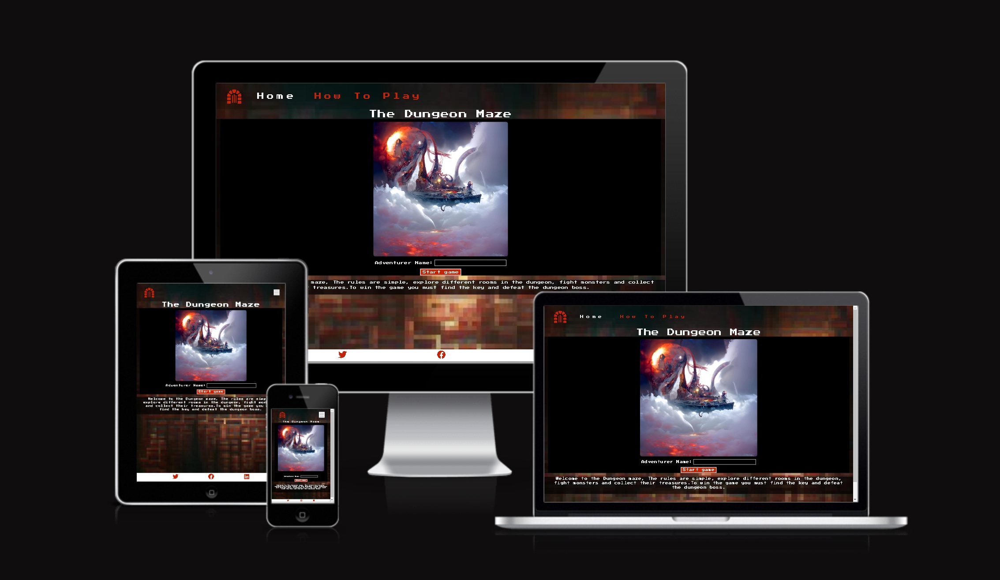

---
## Contents

### [UX](#ux-1)
### [User Requirements and Expectations](#user-requirements-and-expectations-1) 
### [Developer goals](#developer-goals-1) 
### [User Stories](#user-stories-1)
### [Design Choices](#design-choices-1) 
### [Wireframes](#wireframes-1)
### [Features](#features-1)
### [Technologies Used](#technologies-used-1)
### [Depolyment](#deployment) 
### [Testing](#testing-1) 
### [Bugs](#bugs-1)
### [Credits](#credits-1)
---
## UX:

### Project goals: 

- To create a fun interactive game based upon classic board game mechanics
- To experiment with Javascript

---
### Target Audience: 

- The website is targeted at people of all ages who enjoy playing games
- Users who enjoy the classic fantasy genre

---
### Target Audience goals: 

- To be able to navigate around the site and access the right information the need to play the game
- To be able to interact with the website and play the game
---
## User Requirements and Expectations

The website features both visual and written content with interactive elements. Feedback will be given to the user whenever they make a decision and there will be clear descriptions of how to play the game. The web content will be structured into different web pages that display appropriate information to the user. There will be social links in the footer for the user to visit.
The dungeon maze is a great website for this as it gives good feedback to the user through the use of alerts on larger screens and outputting text into a div to display alerts to users on smaller screens where alerts are disabled. The web pages' contents follow a nice structured flow. Creating nice pathways for the users to follow.

---
## Developer goals: 

- To create a fun and engaging site for users to visit
- To experiment with JavaScript and create an interactive front-end project
- To build on and develop a better understanding of javascript

---
## User Stories: 

### First-Time Users:

- As a first-time user, I want to be able to interact with the website and play the game
- I need to be able to find the information I need to play the game easily
- I want to know how my decisions impact the game
- When I play the game I want the game information both written and visual displayed to me in an easy-to-follow format
- I need to be able to reset the game when I need to

### Returning users:

- I want to be able to replay the game
- I want to be able to beat my old score and compete against others 

## Design Choices 

---

### Colors:

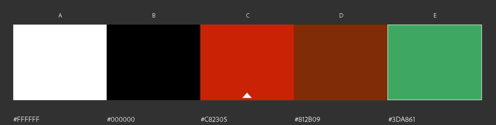

I used this colour palette on the site. The colours from this palette came from the images I generated. I also used colours which I thought contrasted well with the other colours such as whites and blacks. 

---
### Fonts

I used the google font Press Start 2P across the website. I decided to use this font for both the titles and then other text to keep consistency and because it built upon the retro style that I wanted to create. Another reason was that the font was easily readable in smaller sizes.

---
### Imagery

The images for the website were created using an online ai art generation tool. I chose to use the image title dungeon maze title image because it was the most unique image that I generated. Injecting a unique fantasy feeling to the site to try and get an emotional response from the user when they first land on the site. The emotion I wanted to capture was nostalgia. The other images that are on the site in the generated image section were created using the same approach as the hero image. I matched the images to the text descriptions to create a nice flow of written and visual information and so that the images displayed made sense visually as to what the text was describing. I took quite a loose approach to this on some of the images. However, this was to create a retro/unique feeling because of what the ai art generator created. I used a blurred effect on the background image to create a retro game effect whilst keeping the other images more modern and high quality.

---
### Styling 

All the containers on the site are set to be fluid so that they cover the screen size. Which creates a more modern look than other retro games, where the game is in a normal container. The area behind the images was set to black to emulate a small screen. The information given to the user in all areas follows the format of the image and then written information so that the image is the first piece of information the user sees. On smaller screens, an output area was created for the user to be given feedback from the game. Javascript alerts replace this on larger screens. The buttons are colour coordinated so that the user can see which buttons can be pressed at different stages of the game. The how-to-play modal is styled to contrast with the rest of the game. Finally, the images and text areas use a fade animation to try and emulate the effect older style games used to have when they loaded.

---
## WireFrames: 

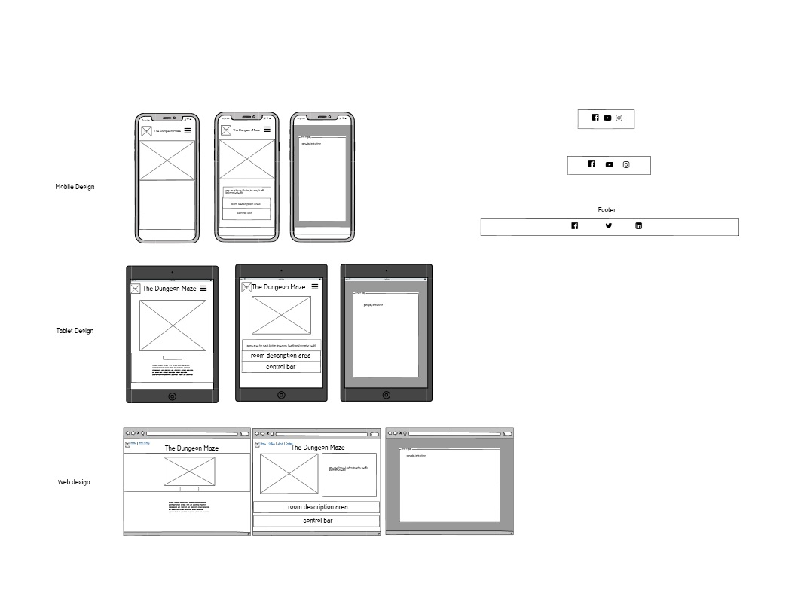

---
## Features: 

### Current Features:

### Navbar 

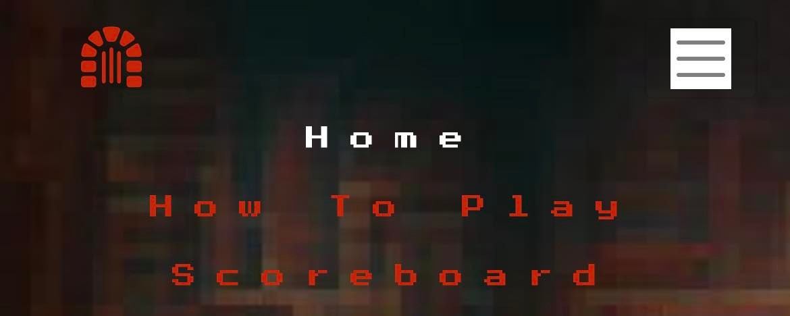
- The navbar includes the links to all the different pages on the site and a logo which links to the home page
- On smaller screens, the navbar collapses behind a burger icon making it responsive across screen sizes
- The navbar has a modal built into the how-to-play link which gives users accurate descriptions of how to - play the game without having to leave the page they're on.
- The navbar for this site is not fixed to the top of the page to save screen space and because the site doesn't have much vertical content
### Footer 

- The footer includes links to external sources in particular social media links that all open on separate web tabs
- The footer is responsive across all screen sizes 

### Load Screen 
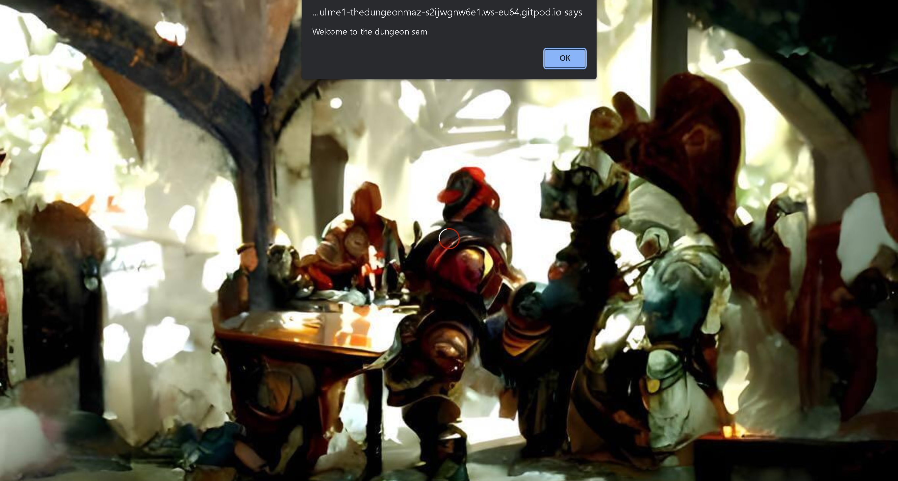
- Stays in place until the web page content has been loaded for the game
- The loading screen is responsive across all devices, the image doesn't stretch

### High Score Area
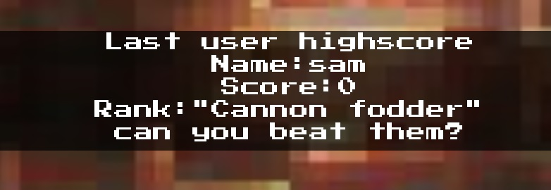
- The high score area allows the user to see the high score of the person who last played so that they can compete against them
- The high score area is responsive across all devices
Prevents default data from being stored by displaying a message when no score has been recorded yet

### Hero Image

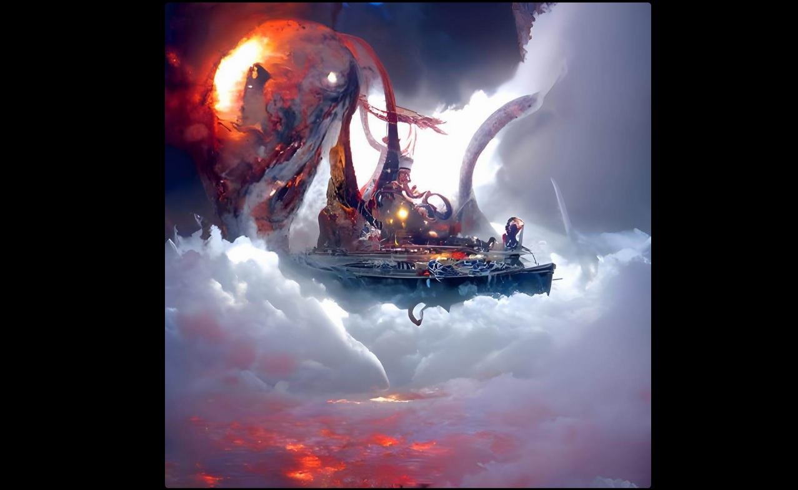
- creates an emotional response of wonder and nostalgia when the user first lands on the site because of the nature of the image and the contrast with the retro background.
- Is responsive across all devices
### User Form 

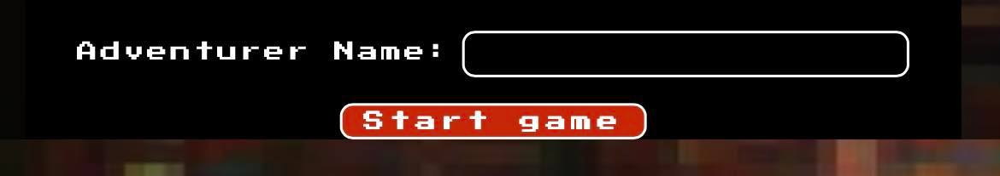
- The form element on the site allows the user to access the game page by interacting with the input and submitting their name
- Uses local storage to validate input information and store the user's name. This later results in the user receiving an alert message when they enter the game.
- The form is responsive across all device sizes
- Validates data preventing default values
### Reset Button

- The reset button resets all the game areas and the game JS ready for the user to start over
- Is responsive across all device sizes
### Small screen text output area and alerts 

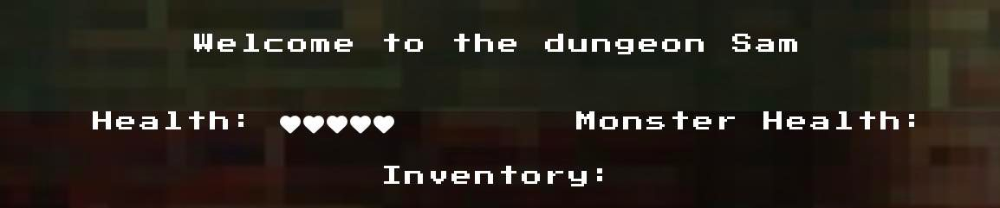
- The small screen text output area works as a way of displaying alerts to users who are on smaller devices or using browsers where alert messages are not supported
- The alerts give feedback to the user based on their actions and decisions in the game
- On larger screens the small screen output is hidden.
### Health areas and inventory area

- The health and inventory areas allow the user to see their status in the game. How many hearts they have left, how many the monster has and which items they have in their inventory.
- The health and inventory areas are responsive across all devices

### Gameplay buttons 

- The gameplay buttons allow the user to interact and progress in the game. They have the option of moving to the next room, drinking a potion to heal their hit points back up and attacking/blocking.
- The buttons are colour coded to show the user which actions they can take at a certain time. For example when they go to a new room. They have to fight and beat the monster to progress.

### Game image output area 

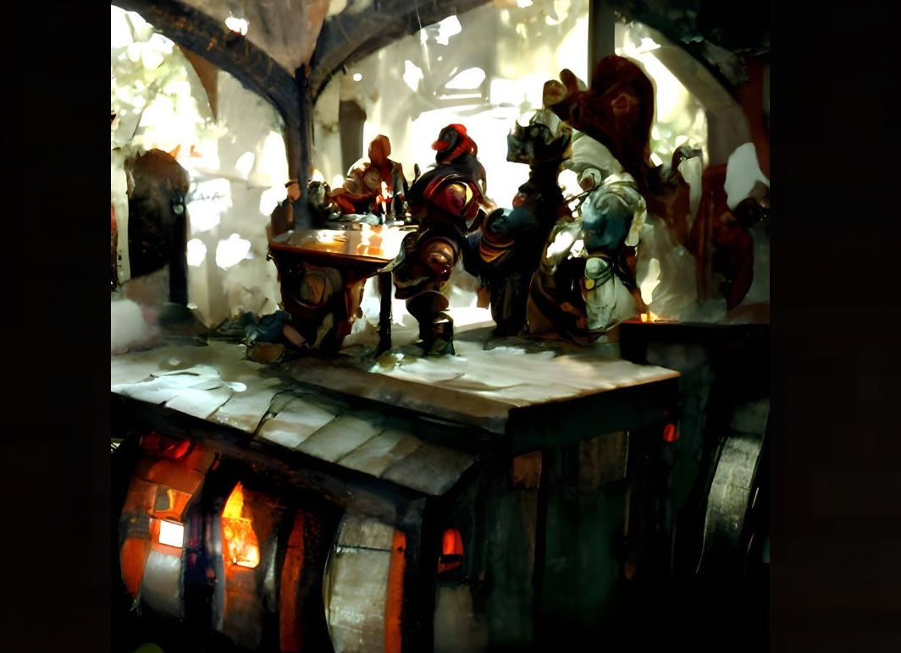
- Outputs an image to the user that is generated and assigned with the matching output text giving them a visual description of what's happening in the game
- When the images are generated the alt attributes are also changed for good practice and also to give an alternative description to visually impaired users
- The images are responsive across all device sizes
- Changes to reflect if they die or when they lose the game
### Game text output area

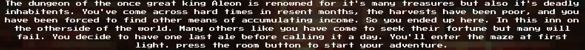
- Outputs text to the user giving them descriptions of what's happening in the game
- Changes to reflect if they die or when they lose the game
- Tells the user their score and rank at the end of the game
---
### Future Features:

- I like to add different classes for the user to select. Different classes will do more damage and have different abilities and vulnerabilities. Such as a wizard that can do 2 damage on attacking but only has 3 life
- I'd like to add a shop so that the users can purchase upgrades for their characters such as better weapons and more life

### Naming Conventions and Structure of Files 

- All the files on the site have been named with consistency and structured into their appropriate sections
- Names contain lowercase and no special characters
- Javascript variables follow the format of camelsCase
- Images have been organised into different sections, the first image folder contains all the images used on - the site and the nested folder contains all the images used on the readme
- Separate Javascript files have been created for the different webpages, constant variables have been structured into a separate const.js file

## Technologies used: 

### Languages: 

1. [HTML5](https://www.w3schools.com/html/default.asp) To create the structure and the content of the website
2. [CSS3](https://www.w3schools.com/css/) To create the style for the website and its content
3. [Javascript](https://www.w3schools.com/js/) creates the functionality for the website
---
### Tools and libraries:

1. [Gitpod](https://www.gitpod.io/) To create and code the site
2. [Github](https://github.com/) To host, deploy and store the site
3. [Balsamiq](https://balsamiq.com/wireframes/?gclid=CjwKCAjwpqCZBhAbEiwAa7pXeX1wZJAVRJoBFg6LSTf1Nr4XKXuI4jzQYJKS4xrcwxdCR318YRSoRxoCKo4QAvD_BwE) To create the wireframes for the site
4. [Bootstrap](https://getbootstrap.com/) Is Used to create site responsiveness across different screen sizes and for the modal and navbar
5. [Tinypng](https://tinypng.com/) To compress images for better page load times
6. [Google Fonts](https://fonts.google.com/about) To import fonts to the site
7. [Grammarly](https://app.grammarly.com/) To correct spelling, punctuation and grammar
8. [Font Awesome](https://fontawesome.com/) To create the icons used on the site in the navbar, modal, buttons and footer
9. [Adobe Colourwheel](https://color.adobe.com/create/color-wheel) To create the colour scheme for the website
10. [Jigsaw](https://jigsaw.w3.org/css-validator/validator) To validate CSS
11. [nu Html Checker](https://validator.w3.org/) To validate HTML 
13. [Jshint](https://jshint.com/) To validate Javascript 
14. [NightCafe](https://nightcafe.studio/) To create the images used on the site
15. [Luapic](https://www4.lunapic.com/editor/) To create the pixelated effect on the background image

---
## Deployment

### This site is deployed in Github pages. These steps were taken on deployment

1. Login and locate the repository titled [the dungeon maze](https://github.com/SamHulme1/the-dungeon-maze).
2. Locate the settings at the top of the repository menu. Make sure not to click the settings at the top of the page
3. Scroll down the page, to the left you should be able to see pages under Code and Automation click pages
4. Change the source branch from none to main using the dropdown menu
5. Doing this will refresh the page, scroll back down and locate the link to the active page. Click the link to see the deployed site!

### This site was developed using Git. Here is the development lifecycle:

1. I created a new repository by using Code Institutes template
2. In the terminal, I typed git init to initialise
3. I created all the files and folders for the project
4. I used the command git add . in the terminal to add the files to the repository
5. I enter git commit and wrote a commit message in "" 
6. For each change that I made I used the git add . and commit commands
7. I used git push to push the changes in Git to Github

## Testing 

### Testing User's Stories 

#### First Time User

As a first-time user, the first time I land on the site I can gain an understanding of what the website is about, and I can easily navigate around the website easily and use the site on all my devices. I can play the game easily and see how the website gives me feedback based on my input. I can do all this by:
- Reading the description on the landing page of how to play the game
If I'm unsure about the controls I can visit the how-to-play section in the navbar
- Reading the alerts that the game gives to me when I enter my name and when I make decisions in the game on larger screens and reading the information given to me in the small screen output section
- I can see at which stage of the game I'm in and which buttons I need to press during the game through the use of colour-coded buttons and the output images and text displayed to me
- I can track my session progress when im playing the game by checking which items I have in my inventory and how much health I have left. I can also see how much heath my opponent has
- I can reset my progress if I need to

#### Returning User

As a returning user my main focus is to replay the game and try and beat a high score I can do this by:
- Re-entering the website and replaying the game
- Seeing the high score of the person who most recently played the game at trying to beat it (the score is displayed to the user when they beat the game or die and is updated on the index page. Future versions of the game will include a scoreboard to display the data of all users who play the game, not just the most recent player I ran out of time to develop this feature)
---
### Developer goals have been met by

- I have created an interactive and engaging front-end website for users and to put in my portfolio
- Developing this site has allowed me to develop a much better understanding of Javascript through experimenting and trial and error
---
### Site responsiveness and compatibility

The site has been tested for responsiveness on the following devices using Google Developer tools:
- Blackberry Z30
- Blackberry PlayBook
- Galaxy Note 3
- Galaxy Note 2
- Galaxy S3 
- Galaxy S8
- Galaxy S9 Plus
- Galaxy Tab S4 
- Galaxy S20 Ultra
- Galaxy Fold
- Galaxy A51
- Kindle Fire HDX
- LG Optimus L70
- Microsoft Lumia 550
- Microsoft Lumia 950
- Moto G4 
- Nexus 10, 4, 5, 5X, 6, 6P, 7, 
- Nokia Lumia 520
- Nokia N9
- Pixel 3, 4, 3 XL, 5
- Ipad mini, Ipad, Ipad Pro
- iPhone 4, SE, XR, 12 Pro
- JioPhone 2
- Ipad air, mini
- Surface Pro 7, Duo
- Nest Hub, Hub Max
- iPhone 5, SE, 6, 7, 8, X
- larger screen sizes such as 4k have also been tested
Bootstrap, as well as media queries, were used to achieve responsiveness

---
#### LightHouse 

Lighthouse scores for the project are below slower performace on the mobile is caused by the document 
having to load code from external sources such as bootstrap.
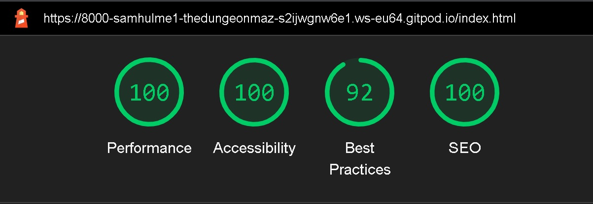
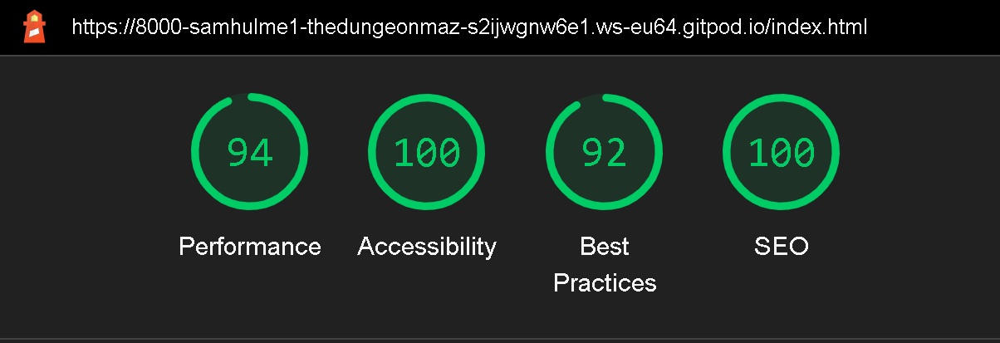
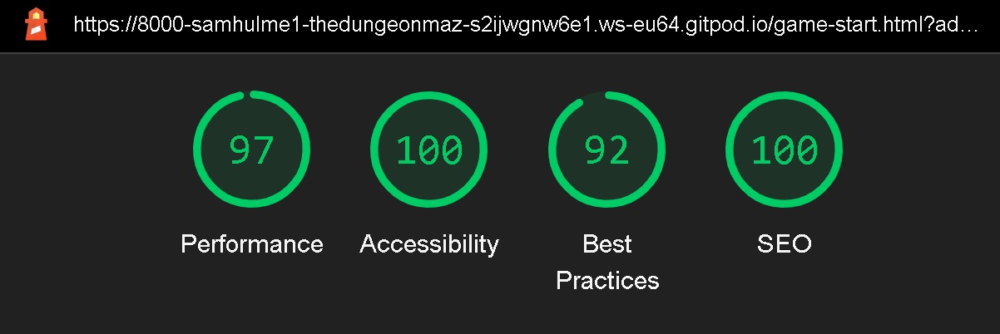
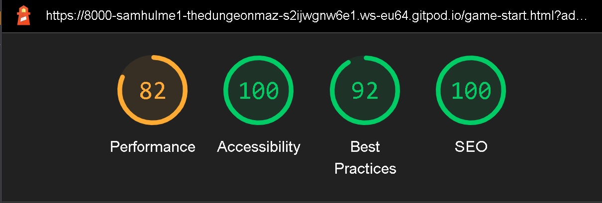

---
### Online validators 

The final validator results can be seen here:

---
### Javascript Validation

#### Game const and game-start 
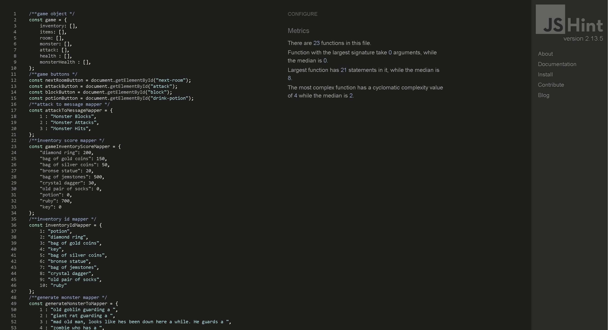

#### Game index 
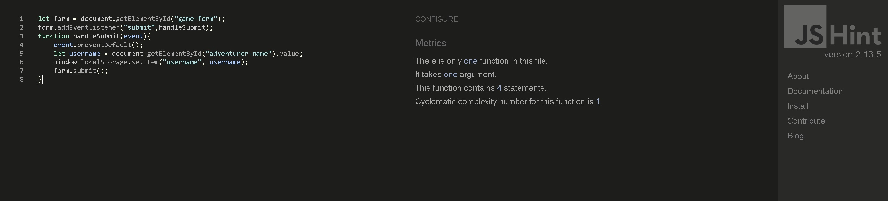

---
### CSS Validation

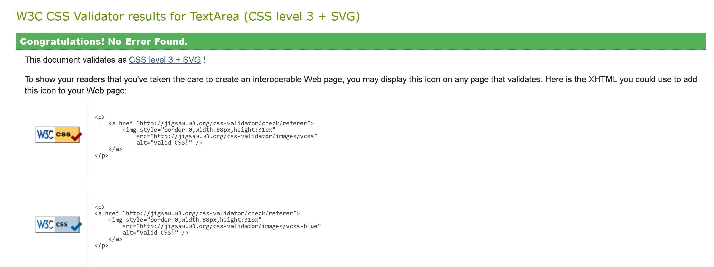

---
### HTML Validation

#### Game-start

#### index
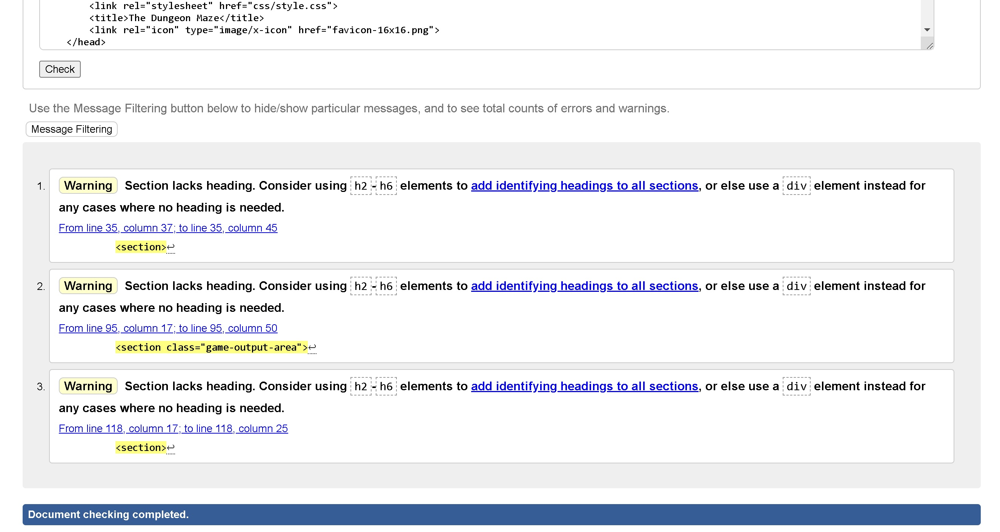

---
### Manual Tests run on site

1. Do all the navigation elements work on the site?
- Expected: All the navigation elements will work
- Result: All the navigation element work as intended
2. Do all the buttons work on the site?
- Expected: All of the buttons will work
- Result: All of the buttons work as intended
3. Does the website give the correct feedback?
- Expected: The site will respond to the user and give them feedback
- Result: The website gives the correct feedback to the user through alerts and the small screen feedback screen. The buttons and game areas play different colours to reflect stages of the game and the text and images change. The code works as intended
4. What happens when I drink a potion?
- Expected: The health array will be at a length of 5 and there will be 5 hearts on the screen
- Result: The health array is passed more hearts and the user gains more hearts in the HTML. The code works as intended
5. What happens when I beat the game?
- Expected: The game will show the user the win screen with their score and rank
- Result: I'm given the endgame screen with the correct text and image content. The score and rank are displayed to me. The code works as intended.
6. What happens when I lose the game?
- Expected: The game will show the user the death screen with their score and rank
- Result: I'm given the death screen with the correct text and image content. The score and rank are displayed to me. The code works as intended.
7. What happens when I attack?
- Expected the user will get an alert telling them what happened during the combat phase. The user can damage or be damaged by the monster
- Result: I can damage or be damaged by the monster. Code works as expected
8. What happens when I block?
- Expected: the user will get an alert telling them what happened during the combat phase. The user blocks or is damaged by the monster 
- Result: I can block or be damaged by the monster. Code works as expected
9. Can I have more than one potion in my inventory?
- Expected: I will be able to hold and use more than one potion
- Old result: All my potions were removed from my inventory. 
- New result: I can have multiple potions in my inventory at the same time. The code now works as intended. I can still drink a potion when I'm at max health but this was intended.
10. Do all the external links open in separate tabs?
- Expected: All the links will work and open in separate tabs
- Result: All the links open in separate tabs as intended
11. Does the input work on the index page?
- Expected the user will enter their name and receive an alert welcoming them to the game
- Result: The input works as intended the message is displayed correctly

---
### Unit Testing

Unit testing is done at the start of the development to ensure that the core functions worked as intended. Some of the function names have changed and there are a few functions that were added later and tested using other means like [Pythontutor](https://pythontutor.com/) but these tests helped me to build a solid foundation for the game. Old unit tests can be found [here](scripts/tests/game.test.js).

---
### Browser testing 

The site has been tested on Chrome, Firefox, Safari and Microsoft Edge

---
## Bugs 

Here are some of the bugs that I've found and fixed throughout development:
1. Spelling error on score mapper causing it to return NAN when calculating scores
- Fixed by correcting spelling
2. Potion function not adding all the hearts to the HTML screen
- Fixed by removing the remove potion function accidentally put in the while loop and calling the function outside the loop
3. Generate room function would cause an error in the console, error was caused because when the number generated was 10 there wasn't a room 10
- Fixed by changing the generate room function to create a number between 1-9 instead
4. Other known bugs have been fixed and documented in commit messages.

---
### Bugs Left in Code:

- Sometimes the score doesn't map correctly for certain items in particular the gold coins.
- In chrome, the website gives a violation warning when clicking the attack and block buttons because of the length of the code. I've left this in because it's not an error but I wanted to mention it so that I can refer back to this in the future. I've added a load screen to the page in case it takes longer to load.

---
## Credits 

### Code

- Bootstrap 4 was used throughout development to make the site responsive, I used this for layout and used some of Bootstraps classes, I also used it for the navbar and modal
- I used code from this source to fix a bug with my footer not sticking to the bottom of the webpage which can be found [here](https://www.freecodecamp.org/news/how-to-keep-your-footer-where-it-belongs-59c6aa05c59c/)
- I used an animation from this source in my code to create the fade effects on the text and images which can be found [here](https://medium.com/cloud-native-the-gathering/how-to-use-css-to-fade-in-and-fade-out-html-text-and-pictures-f45c11364f08)

---
### Content 

- All written content for the site came from me the developer

---
### Media

- The images for the site were created using an online AI image generator [NightCafe](https://nightcafe.studio/)
- The favicon was created using [Favicon Io](https://favicon.io/favicon-converter/)
### Acknowledgements

- My mentor for the amazing help and support 
- Other students on slack for their support 
- Code Institute for the helpful materials and support
- W3C for their library of information when I needed a quick refresher on the content I'd learnt about during the course